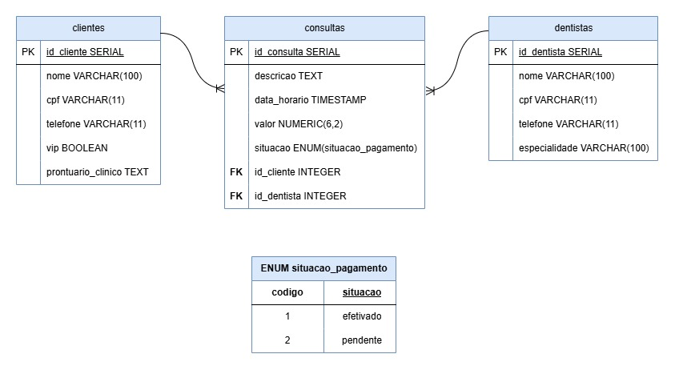

# Sorriso Metálico

Sistema desenvolvido para **Sorriso Metálico**, com o objetivo de auxiliar na gestão de pacientes, prontuários e agendamentos odontológicos. A plataforma permite o gerenciamento de pacientes comuns e VIP, oferecendo prioridade e autonomia de agendamento aos clientes VIP, além de facilitar o controle dos atendimentos pela recepção e pelos dentistas.

---

## MER (Modelo Entidade-Relacionamento)

### Entidades e Atributos

#### clientes
- id_cliente SERIAL PRIMARY KEY
- nome VARCHAR(100)
- cpf VARCHAR(11)
- telefone VARCHAR(11)
- vip BOOLEAN
- prontuario_clinico TEXT

#### consultas
- id_consulta SERIAL PRIMARY KEY
- descricao TEXT
- data_horario TIMESTAMP
- valor NUMERIC(6,2)
- situacao ENUM(situacao_pagamento)
- id_cliente INTEGER FOREIGN KEY
- id_dentista INTEGER FOREIGN KEY

#### dentistas
- id_dentista SERIAL PRIMARY KEY
- nome VARCHAR(100)
- cpf VARCHAR(11)
- telefone VARCHAR(11)
- especialidade VARCHAR(100)

### Relacionamentos
- 1 cliente passa por N consultas
- 1 dentista realiza N consultas

---

## DER (Diagrama Entidade-Relacionamento)

